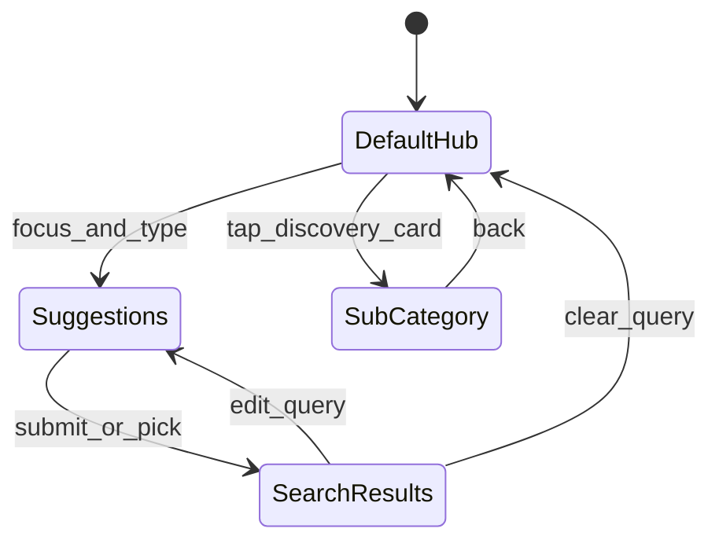

# YTLite: Search Tab Technical Specification (Video Search)

## 0. Product decisions

| Decision | Description |
|----------|-------------|
| Entry | **5th bottom tab** (Search) |
| Paradigm | **YouTube video search** (not strict YT Music) |
| Discovery | v1 uses **real InnerTube browse** |
| Results | **Tabbed**: All / Videos / Channels / Playlists |
| Voice / Identify | v1 **disabled** + Coming soon |
| Recent clear | **Long-press** single delete + **Clear All** on Recent cards |

## 0.1 Non-goals (v1)

- Real voice search or audio identification
- Upload date / duration filters
- Shorts-only search tab
- Cloud sync of search history

## 0.2 Terminology mapping

| UI term | Data semantics |
|---------|----------------|
| Video suggestion | `videoRenderer` / `compactVideoRenderer` |
| Channel suggestion | `channelRenderer` / `gridChannelRenderer` |
| Query history | Room `search_queries` (max 15 FIFO) |
| Recent searches cards | Room `search_recent_clicks` (video/channel targets) |
| New releases / Charts / Moods | Video-oriented **Explore** sub-pages via `browse` |

Hint: `Search videos, channels...`

---

## 1. Screen state machine

Four core states in one tab:

1. **DefaultHub** — empty/focused with no active results
2. **Suggestions** — debounced query, heterogeneous suggest list
3. **SearchResults** — submitted query with All/Videos/Channels/Playlists tabs
4. **SubCategory** — Discovery sub-pages (New releases, Charts, Moods and genres)

**SearchResults** triggers: keyboard Search, suggestion tap, Recent card tap.

---

## 2. UI specification

### 2.1 Search bar
- Rounded container, hint `Search videos, channels...`
- Right: Microphone + Waveform (v1 disabled, Coming soon snackbar)
- Clear (X) when query non-empty
- **300ms debounce** on input before network

### 2.2 Default Hub
1. **Recent searches** — horizontal `LazyRow`; title row with **Clear All**; long-press deletes one card
2. **Search history** — vertical list, clock icon, ↖ fills query without submit; optional clear-all for text history
3. **Discovery cards** — New releases, Charts, Moods and genres

### 2.3 Suggestions (heterogeneous)
- Query (history match)
- Channel (circle avatar, subscriber subtitle)
- Video (square thumb, view count subtitle)

Use `contentType` + stable `key` in `LazyColumn`.

### 2.4 Search results
- `TabRow`: All, Videos, Channels, Playlists
- InnerTube `params` per tab
- Pagination via `continuation`

### 2.5 Discovery sub-pages (video + browse)
| Card | Content |
|------|---------|
| New releases | Feature banner + horizontal video shelf |
| Charts | Region dropdown (Global) + ranked videos |
| Moods and genres | 2-column grid, left accent color bar |

---

## 3. Performance guards

- `debounce(300)` on query in ViewModel
- `contentType` on suggestion/result lists
- Images: RGB_565 via shared `LibraryImage`
- Search query FIFO cap: 15 entries

## 4. Acceptance criteria

- 5th Search tab visible
- Debounce prevents per-keystroke API calls
- Tab params return correct result types
- Recent Clear All + long-press delete work
- Voice buttons show Coming soon when tapped
- Build passes `assembleDebug`
